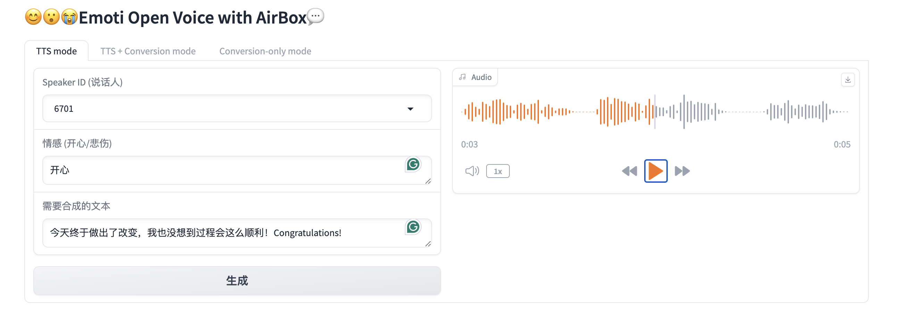
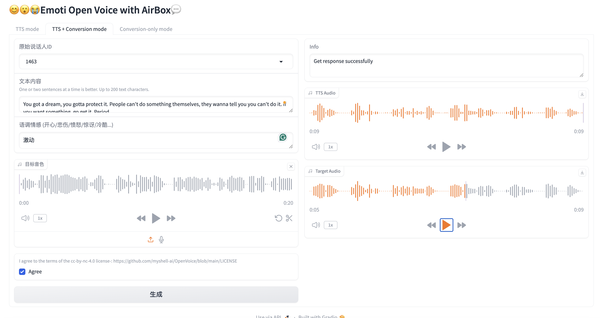
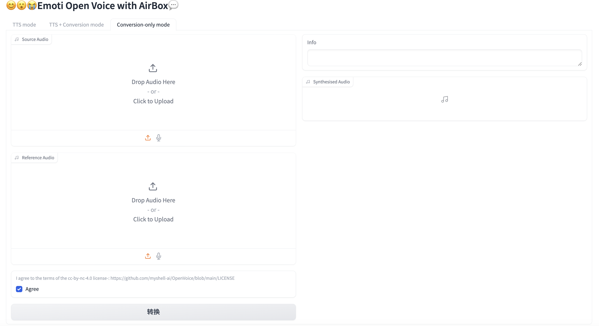

# Text-to-speech and tone color conversion on your Airbox

This is a SG2300x-adapted demo of EmotiVoice(@NetEase Youdao) and OpenVoice(@MyShell.ai).

## 0. Clone the repository.

`git clone https://github.com/ZillaRU/EmotiVoice-TPU.git`

## 1. Download bmodels
`bash download.sh`

## 2. Setup environment
`bash prepare.sh`

## 2. Run web demo
Run the following script.
```sh
python3 demo_page.py
```
Three tabs for *TTS*, *TTS+tone color cloning* and *tone color cloning* are shown.





## 3. Using OpenAi-like api
- Install the dependencies: `pip3 install fastapi pydub uvicorn[standard] pyrubberband`.
- Then, run `uvicorn openai_api:app --reload --host 0.0.0.0 --port [port_number]`, the service will be available at `hostip:port_number` in few seconds.
The way to call the service is exactly the same as using OpenAI's TTS service.

## For more detailed usage, please refer to the README from the original repo of [EmotiVoice](https://github.com/netease-youdao/EmotiVoice) and [OpenVoice](https://github.com/myshell-ai/OpenVoice).

## Issues
The torch version *higher than 2.3* might lead to an ERROR due to poor compatibility for ARM platform.
